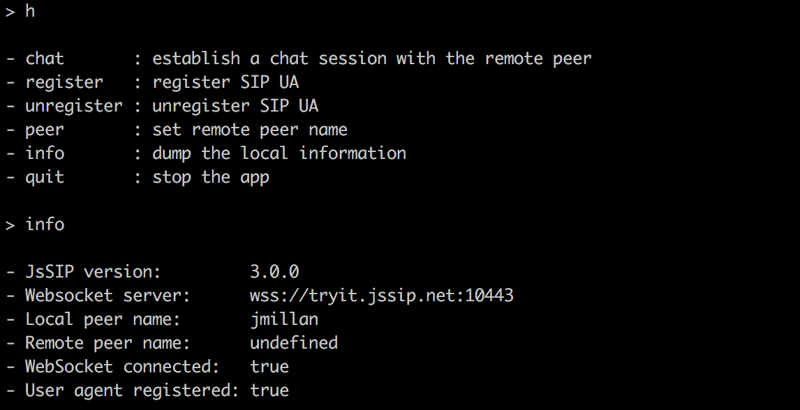

## Description

Minimal demo of JsSIP usage on Node.js.

The application is built around the <a href="https://tryit.jssip.net/">Tryit JsSIP demo</a> and takes the configuration information used there.

A file named `config.js` is required with the configuration information.
The `config_example.js` file can be used as a template.

The application provides a basic CLI to monitor and control a SIP User Agent instance.

<p align="left"></p>

## Installation

```git clone git@github.com:jmillan/fosdem.git && cd fosdem && npm install```

## Configuration
```cp config_example.js config.js```

Modify the config.js file with valid information.

## Usage

Usage with disabled debug:

```node app.js```

Usage with enabled JsSIP and application debug:

```DEBUG='JsSIP* fosdem*' node app.js```

Usage with enabled application debug:

```DEBUG='fosdem*' node app.js```


## Note

The example configuration points to the JsSIP Tryit service.
You are encouraged to use your own WebSocket server.
The WebSocket connection attempts to the JsSIP Tryit service may be rejected at any time.
